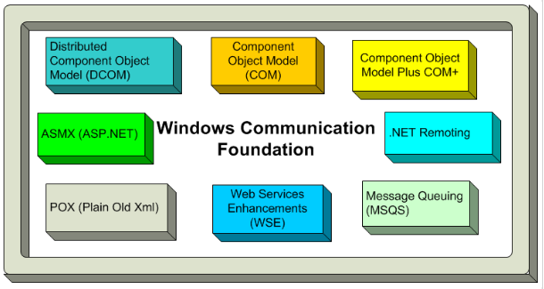
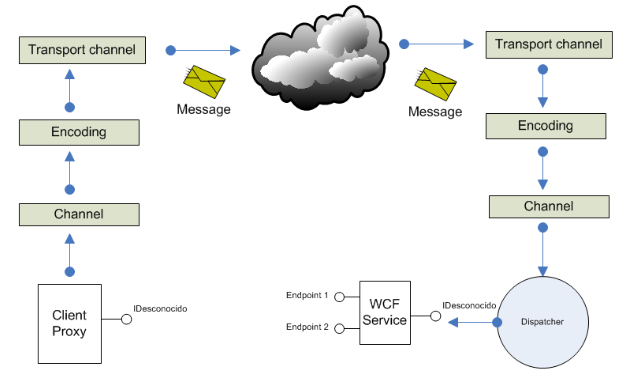
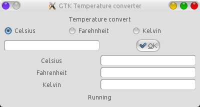
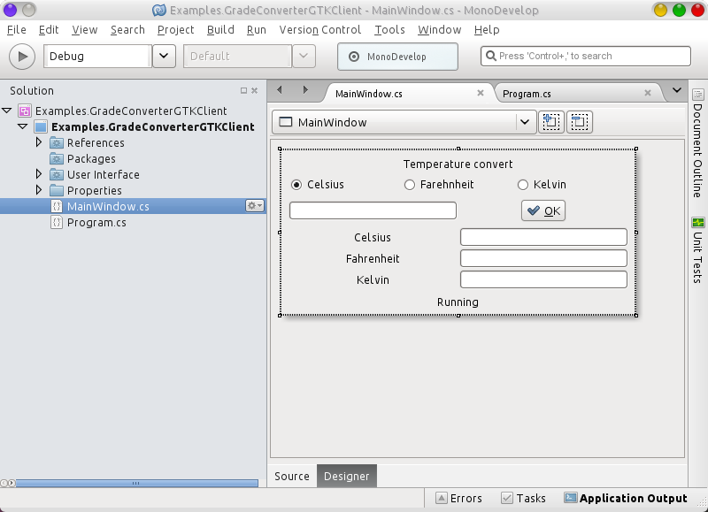
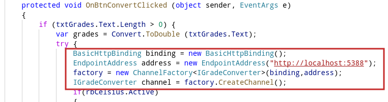
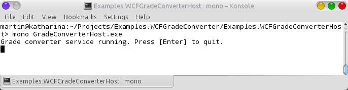
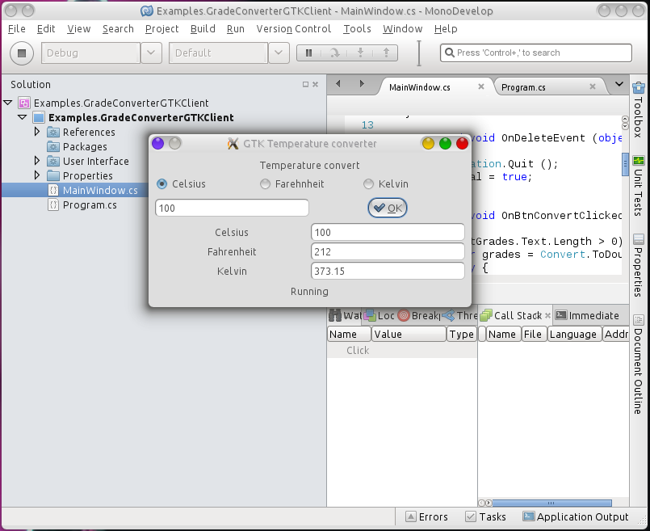
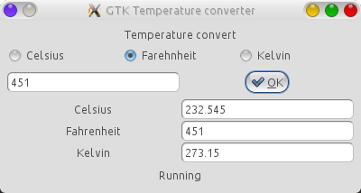

# WCF Construir el proxy manualmente 

      WCF es el marco de desarrollo de aplicaciones que agrupa las tecnologías distribuidas de Microsoft para la construcción de aplicaciones orientadas a servicios.
    

    
<b>Fig 1 WCF agrupa las tecnologías distribuidas de MS en un solo marco de trabajo</b>
 
    

 
    

    WCF ayuda a construir aplicaciones orientadas a servicios de forma práctica 
<ul>
  <li>Proporciona herramientas para la creación, el consumo y la puesta en operación de los servicios.</li>
  <li>Todas las funcionalidades son administradas por el runtime</li>
  <li>No es necesario aprender o conocer a profundidad WSDL.</li>
</ul>
La arquitectura de WCF puede resumirse en el siguiente esquema.
    

     
<b>Fig 2 Una vista general de la arquitectura de WCF</b>
 
    

 
    

    En este esquema se muestra los siguientes pasos de comunicación:
    <ol>
 <li>Los clientes utilizan un objeto proxy para enviar mensajes al servicio. Este proxy se encarga de todo el mecanismo de comunicación y funciona como si fuera un objeto local.</li>
 <li>Los clientes envían mensajes y reciben respuestas mediante el uso de un Endpoint que los conecta con el servicio.</li>
 <li>Un servicio WCF utiliza un dispatcher para convertir el mensaje de petición en la invocación de un método en el servicio.</li>
 <li>Los servicios escuchan por los mensajes en uno o más Endpoints.</li>
</ol>
    

    <h3>La estructura de un servicio WCF: El contrato y la implementación</h3>
    

    Para ejemplificar cada uno de los componentes de la estructura estándar de un servicio WCF escribí un servicio conversor de temperaturas para convertir entre las diferentes escalas de temperatura: Celsius, Kelvin, Fahrenheit.
    Este servicio WCF conversor de temperaturas tiene los siguientes elementos:
    

 

 1.Un contrato para el servicio: qué es la interfaz que define las operaciones y como es el proceso de comunicación para el intercambio de mensajes.
Este contrato contiene los siguientes elementos:
 
a) La referencia al ensamblado System.ServiceModel, este ensamblado proporciona los objetos necesarios para construir los servicios WCF.

 
b) Una interfaz con el atributo ServiceContract que identifica a la interfaz que el servicio implementará.

 
c) El atributo OperationContract para identificar cada uno de los métodos que el servicio expondrá.

 

 

 2. La implementación del servicio: Es la clase que implementará la interfaz Service Contract, esta clase utilizará los componentes del .NET Framework con unos atributos WCF opcionales para controlar las características del servicio tales como el tiempo de vida y las sesiones.
 

    

Ambos archivos, (el contrato <i>IGradeConverter</i> y la implementación <i>GradeConverterImplementation)</i> deben compilarse como biblioteca :NET con el siguiente comando.

<pre>
$ mcs /t:library -pkg:wcf IGradeConverter.cs GradeConverterImplementation.cs 
/out:Examples.WCFGradeConverter.Service.dll
</pre>
   <h3>El proceso huesped (Self-hosted application)</h3>
   

   3. Un proceso huésped: Este proceso huésped debe proporcionar el ambiente de ejecución para un servicio WCF. Para hospedad un servicio WCF existen 3 opciones principales:
   <ol>
   <li>Self hosted managed application</li>
   <li>IIS</li>
   <li>WAS</li>
   </ol>
   

   

   En este ejemplo utilizaré la opción <b>Self hosted managed application.</b>
   

 

 Este proceso huésped requiere información de configuración, por lo que esta información se proporciona en un archivo de configuración.
 

 

 Para compilar el proceso huésped utilizamos los siguientes comandos:
 

 <pre>
 $ mcs -r:Examples.WCFGradeConverter.Service.dll -pkg:wcf GradeConverterHost.cs 
 </pre>
 <h3>Construyendo el programa cliente GTK# temperature converter.</h3>
 

 Para consumir el servicio WCF, escribí un proyecto cliente GTK# en Monodevelop que invoca las operaciones del servicio, en la siguiente imagen se puede ver la GUI del programa cliente.
 

  
<b>Fig 3 El aspecto final del convertidor de temperaturas.</b>
 
    

 
  
<b>Fig 4 El proyecto y la GUI del convertidor de temperaturas GTK# en MonoDevelop</b>
 
    

 
 
Hay dos maneras para que un cliente consuma un servicio WCF:
 <ol>
 <li>Puedes generar un objeto proxy manualmente, utilizando la herramienta: svcutil desde la línea de comandos.</li>
 <li>Puedes usar la clase ChannelFactory para crear un proxy de manera programática.</li>
 </ol>
 

  
<b>Fig 5 Utilizando la clase Channel para crear un proxy</b>
 
    

 
 
Para probar el ejemplo, primero hay que iniciar el proceso host.

  
<b>Fig 6 Ejecutando el proceso host</b>
 
    

 
 
Como último paso abrimos el proyecto cliente GTK# y lo ejecutamos desde <b>Mono Develop</b>

  
<b>Fig 7 Ejecutando el programa desde Monodevelop y convirtiendo 100 grados celsius.</b>
 
    

 
  
<b>Fig 8 Ejecutando el programa y convirtiendo 451 grados farehnheit.</b>
 
    

